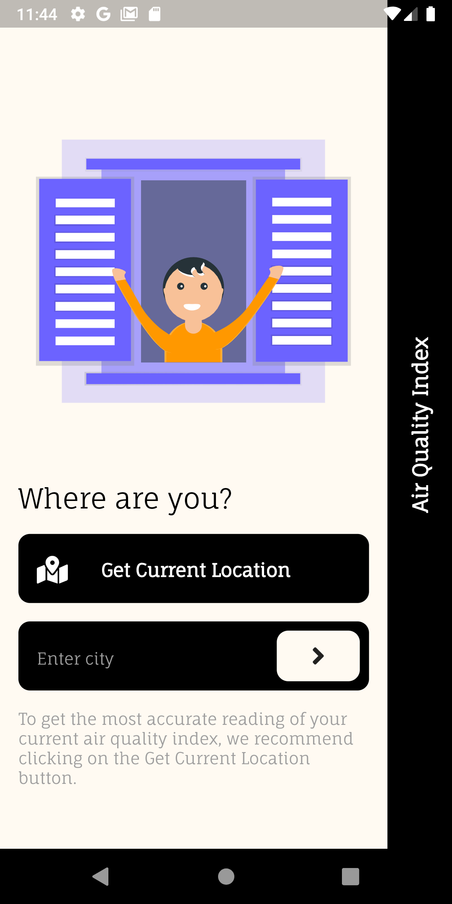
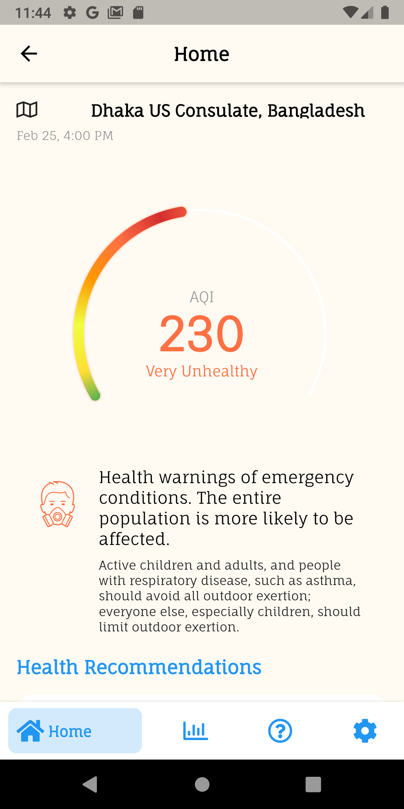
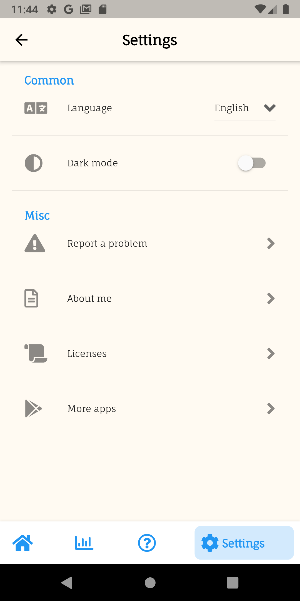

# Air Quality Index


[](https://opensource.org/licenses/0BSD)


|                      Intro Screen                         |                      Home Screen 1                        |                      Home Screen 2                       |
| :---------------------------------------------------------------: | :-------------------------------------------------------------: | :--------------------------------------------------------------: |
|  |  |  |


|                        About Screen 1                         |                         About Screen 2                        |                      Settings Screen                       |
| :---------------------------------------------------------------: | :-------------------------------------------------------------: | :--------------------------------------------------------------: |
|  |  |  |

|                         Dark Mode                      |                         Statistics Screen                        |                      Multilingual support                       |
| :---------------------------------------------------------------: | :-------------------------------------------------------------: | :--------------------------------------------------------------: |
|  |  |  |

## Description
This app aims to help you check the air quality of your area and take necessary precausions. Check the quality of air surrounding you and get recommended health advice based on that. Made using flutter and the [waqi](https://waqi.info/) api.

## Demo
### [Android App](https://drive.google.com/file/d/19pXcv4mxn-XlqRQR1AV1jDbVpSOHHG61/view?usp=sharing)

An android fat application made using Flutter.

(Website in development)


## Features

- [x] Add api repository
- [x] Get user location
- [x] Add place search functionality
- [x] Add circular chart
- [x] Add health recommendations
- [x] Add statistics chart
- [x] Add about page
- [x] Add persistant navbar
- [x] Add expanded tiles
- [x] Add dynamic theming (persistant)
- [ ] Implement caching of data (Offline functionality)
- [ ] Change the syncfusion graph package to flutter_graphs
- [ ] Implement better state management
- [ ] Build the responsive site

## Build Error
You may get this error while building if you're using flutter beta channel or up (Flutter stable should work fine) This is because of the `flutter_svg` package that uses the nullOk parameter which has been removed from flutter beta. The error looks like this:

```dart
FAILURE: Build failed with an exception.

* Where:
Script 'D:\flutter\packages\flutter_tools\gradle\flutter.gradle' line: 991

* What went wrong:
Execution failed for task ':app:compileFlutterBuildDebug'.
> Process 'command 'D:\flutter\bin\flutter.bat'' finished with non-zero exit value 1

* Try:
Run with --stacktrace option to get the stack trace. Run with --info or --debug option to get more log output. Run with --scan to get full insights.

* Get more help at https://help.gradle.org

BUILD FAILED in 15s
Exception: Gradle task assembleDebug failed with exit code 1
```

To fix this error, change the version of `flutter_svg` in the pubspec.yaml file to : 
`flutter_svg: ^0.20.0-nullsafety.3`

After that, run these following commands:

1. `flutter clean`
2. `flutter pub get`
3. `flutter run`
   
## My Socials

[](http://www.facebook.com/ihni7/)
[](http://www.twitter.com/ikramhasandev)
[](https://github.com/ikramhasan/)
[](https://www.reddit.com/user/ikramhasan)
[](https://www.linkedin.com/in/ikram-hasan-8a2b8a205/)

</br>
</br>

<a href="https://github.com/Codelessly/ResponsiveFramework">
  
</a>  &nbsp &nbsp &nbsp

<a href="https://github.com/flutter/flutter">
  
</a>

## License

    BSD Zero Clause License

    Copyright © 2021 ikramhasan

    Permission to use, copy, modify, and/or distribute this software for any
    purpose with or without fee is hereby granted.

    THE SOFTWARE IS PROVIDED "AS IS" AND THE AUTHOR DISCLAIMS ALL WARRANTIES WITH
    REGARD TO THIS SOFTWARE INCLUDING ALL IMPLIED WARRANTIES OF MERCHANTABILITY
    AND FITNESS. IN NO EVENT SHALL THE AUTHOR BE LIABLE FOR ANY SPECIAL, DIRECT,
    INDIRECT, OR CONSEQUENTIAL DAMAGES OR ANY DAMAGES WHATSOEVER RESULTING FROM
    LOSS OF USE, DATA OR PROFITS, WHETHER IN AN ACTION OF CONTRACT, NEGLIGENCE OR
    OTHER TORTIOUS ACTION, ARISING OUT OF OR IN CONNECTION WITH THE USE OR
    PERFORMANCE OF THIS SOFTWARE.
